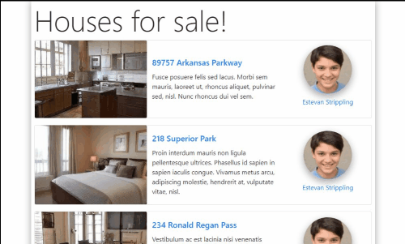
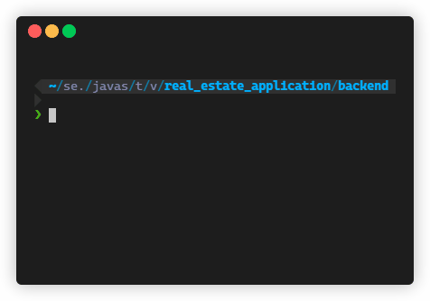

# :house: :heavy_dollar_sign: Real Estate Application

This solutions is made by Sebastian Porling, Mehtab Kayani and David Stjernqvist.
The application can be viewed on [https://vuetastic-real-estate-sp-ds-mk.herokuapp.com/](https://vuetastic-real-estate-sp-ds-mk.herokuapp.com/).

## Demo




## :bomb: Install, Build, Deploy

The simplest way is to use the build script `sh build.sh` if you are running bash.
Other wise do the folliwing:

```bash
cd frontend
npm i
npm run build
cd ../backend
npm i
```

To run the application locally just use you can run `npm run dev` or `npm start` while in the **backend** directory.

We deploy the with docker container through Heroku. We use the **Dockerfile** to build the application.

If you would replace the [house_data.json](./backend/data/house_data.json) with the "original file" you would need to run the **setup.sh** script first.

## :interrobang: Motivation

We decided to manipulate the data to have the following structure:

```json
[
    {
        "id": Integer,
        "first_name": String,
        "last_name": String,
        "telephone": String,
        "email": String,
        "profile_image": "/image/profile/agent-profile-###.jpg",
        "listings": [
            {
                "id": String,
                "address": String,
                "description": String,
                "latitude": Number,
                "longitude": Number,
                "images": [
                    "/image/houses/house-image-###.jpg"
                ]
            }
        ]
    }
]
```

We manipulated the data in order to fetch and use the data easier for the backend and frontend, here are the scripts and what they do:

|script             |functionality                                                              |
|-------------------|---------------------------------------------------------------------------|
|[profileScraper.js](./backend/images/profile/profileScraper.js)|Gets 25 images from thispersondoesnotexist.com|
|[houseScraper.js](./backend/images/houses/houseScraper.js)|Gets 385 images from thisrentaldoesnotexist.com|
|[mapDataScript.js](./backend/mapDataScript.js)|Maps image names to the agents and houses, also adds an ID to the houses|

### :arrow_forward: Frontend

The frontend is made with **Vue** and uses the **vue-router** to handle the routing and logic for the pages. The pages are the "actuall" views that is on the application. They have the following components and functionallity:

|page             |components                                                |functionallity|
|-----------------|----------------------------------------------------------|--------|
|HousesForSalePage|HouseList, HouseListItem, AgenShortInfoCard               |Fetches the API for houses, and keeps track on what "page" of houses we have and increments it everytime we fetch|
|HousePage        |HouseGoogleMap, HouseCarousel, AgentFullInfoCard          |Basically just fetches and displays data|
|AgentPage        |HouseList, HouseListItem, AddHouseModal, AgentFullInfoCard|Fetches from the API and displays data, links to the AddHouseModal|

The components used are the following:

|component          |functionality                                                                  |
|-------------------|-------------------------------------------------------------------------------|
|HouseList          |Generates a list of HouseListItems with the given prop                         |
|HouseListItem      |Generates a list item with information about the house and optionally the agent|
|HouseCarousel      |A image carousel with house images                                             |
|HouseGoogleMap     |A map with showing a marker for a coordinate                                   |
|AgentShortInfoCard |Displays the name and picture of an agent                                      |
|AgentFullInfoCard  |Displays contact info, name and picture of an agent                            |
|AddHouseModal      |A modal that has a form to add a house through the API                         |
|BackButton         |Uses the vue-router to back the browser history                                |

We use the enviroment files to distinguish between the different enviroments. Mostly for the API, as we generate the images as "/path/:id" we have to add the link for the backend if we are in devolpment enviroment. Otherwise the application will be on the same host, then we don't need to add the link.

### :arrow_backward: Backend

The backend uses **express.js** for the server. Most of the interesting logic happens in the **/controllers/api.js** and **/modules/house.js**, basically all the request paths and the logic is happening there. **/controllers/image.js** just redirects the content in the **images** directory. It wasn't possible to package this project as a binary becouse the **pkg.js** can not write on package files, which would be needed as we need to be able to add houses to the **house_data.json** file, so this project has to be deployed and executed as a node application.

Here is all the information about the different HTTP request available, all other request will reviece a 404:

|method |path           |functionallity                                                 |
|-------|---------------|---------------------------------------------------------------|
|GET    |/              |Returns anything that is in the public "dist" folder"          |
|GET    |/image         |Returns any image that is in the "images" folder               |
|GET    |/house/:id     |Returns house with the given id                                |
|GET    |/houses        |Returns the first page of houses                               |
|GET    |/houses/:page  |Returns the houses at the given page, page=1 => houses 0-9...  |
|POST   |/house         |Creates a house on the given agent id                          |
|GET    |/agent/:id     |Returns agent info and their houses at the given agent id      |

Here is information about all the different classes used for handling the application:

|file                       |functionality                                                          |
|---------------------------|-----------------------------------------------------------------------|
|/index.js                  |Starts the server with a cluster with the cpu amount of threads        |
|/server.js                 |Registers controllers, cors, logger, sets body to json parser          |
|/util/welcomeMessage.js    |Displays a welcome message with figlet, also displays IP and PORT      |
|/util/logger.js            |Uses morgan to display logging for HTTP Requests, styling with chalk   |
|/controllers/api.js        |Registers everything about houses and agent                            |
|/controllers/image.js      |Registers static folder for images                                     |
|/controllers/index.js      |Registers api, image and static for dist folder                        |
|/modules/house.js          |All logic for handling the house/agent data                            |
|/integration/fileWriter.js |A json file writer                                                     |
